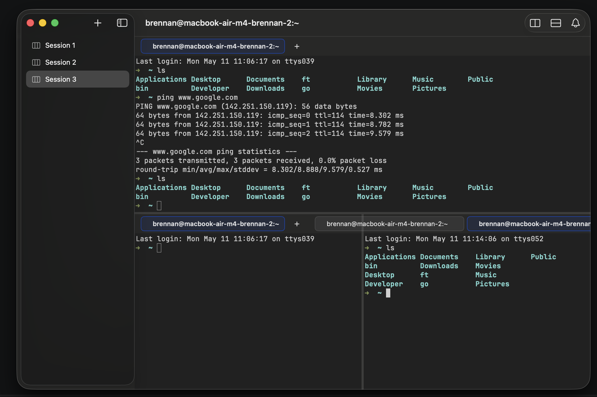

# 0047 — Tab bar contents render past the pane's trailing edge into the adjacent pane

| | |
|---|---|
| **Status** | open |
| **Module** | Tabs / Pane |
| **Platform** | macOS |
| **First seen** | 2026-05-11 |

## Description

When a pane is too narrow for the natural width of its tab chips, the tab bar overflows horizontally and paints into the adjacent pane's tab-bar area. Visually this makes a tab look like it belongs to the wrong pane.

In the attached screenshot the bottom row is a horizontal split. The bottom-right pane has two tabs whose combined chip widths exceed the right pane's available width; the trailing tab is truncated at the window edge and the leading (dim) chip appears physically *left* of the vertical split divider, landing inside the bottom-left pane's tab-bar row. From a glance the left pane looks like it has three tabs.

## Steps to reproduce

1. Open a window, create at least two horizontally-split panes.
2. In the smaller pane, open ~2 tabs so the chips' natural width exceeds the pane width.
3. Observe the right pane's tabs visually crossing the split divider into the adjacent pane.

## Expected behavior

Each pane's tab bar paints strictly within its own frame. Tabs that don't fit are truncated, scrolled, or otherwise contained — but they don't leak into a neighbor.

## Actual behavior

Tab chips from one pane render past the pane's bounds and visually appear in the adjacent pane's tab-bar row. The vertical split divider doesn't act as a visual clip.

## Attachments

## Notes

- Likely root cause: the `SlidingTabBar` inside `PaneView`'s `VStack` (or the `VStack` itself) doesn't apply `.clipped()` to its frame, so content wider than the allotted split-frame width paints into neighboring views.
- A one-line `.clipped()` on the chip row may fix the visual artifact, but it would hide the inaccessible tabs entirely. The proper fix likely pairs clipping with chip-title truncation (tracked as `#0048`) so the user can still see and reach every tab.
- Concept: per `Concepts.md` → Pane, each pane is its own independent container. The tab bar leaking out of the container violates that mental model.
- Related: `#0046` (close-the-last-tab cascade). After a fix here, narrow panes shouldn't become unusable just because their titles are long.
