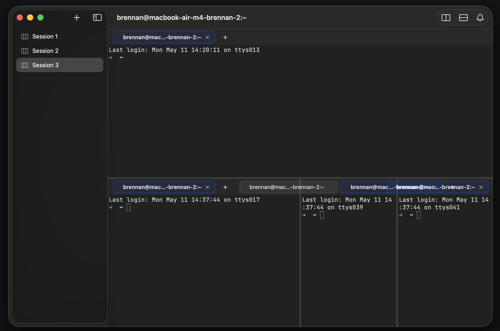

# 0050 — Tab chips all show the same shell user@host string instead of a per-tab label

| | |
|---|---|
| **Status** | closed |
| **Module** | Tabs |
| **Platform** | macOS |
| **First seen** | 2026-05-11 |
| **Closed** | 2026-05-11 |
| **Commit** | 1775948 |

## Description

With multiple tabs open in a pane (or multiple panes in a session, each with their own tab bar), every tab chip displays the same truncated string — `brennan@mac…-brennan-2:~` in the screenshot. The chips can't be told apart visually, so the tab bar stops being useful for navigation.

**Relationship to `#0047`.** `#0047` (resolved `7569183`) was filed against an earlier screenshot of the same situation — tab bars looking wrong in narrow panes. Its scope ended up being narrowed to **the visual overflow** (chips painting past the pane's trailing edge into the adjacent pane), and the fix (`.clipped()` on `SlidingTabBar` plus `#0048`'s width truncation) addresses that surface symptom: in this issue's screenshot the chips are now correctly contained inside each pane's frame. But the **underlying reason the chips needed clipping** — that every chip's natural width was the full `user@host:cwd` prompt string — was never tackled. So `#0047`'s clip is working, and what remains is the duplicated-label problem that motivated the original layout overflow.

Treat `#0050` as the substantive follow-up to `#0047`: change the **content** of the chip label so the chips are short *and* distinguishable in the first place, instead of relying on clip/truncation to hide the symptoms of a poorly-chosen label.

Root cause: `PaneView.chipTitle(for:)` prefers `tab.terminal.title` (the live OSC 0/1/2 string set by the shell) when no `titleOverride` is set. The user's default zsh/bash prompt emits the same `user@host:cwd` string for every running shell. With three same-shell tabs in `~`, all three chips render that same string, which then truncates at the chip's narrow width to a near-identical prefix.

This is **separate from `#0048`** (chip truncation layout — already fixed) and **separate from `#0043`** (session name sticking in the sidebar — already fixed). The sidebar in the screenshot correctly shows `Session 1` / `Session 2` / `Session 3`. The window title correctly shows the live shell string. The bug is specifically in the **per-tab chip label content**.

## Steps to reproduce

1. Launch Batty.
2. In any pane, press `Cmd-T` two or three times to add tabs (all using the default shell).
3. Observe the tab bar — every chip shows `brennan@mac…-brennan-2:~`.

The same shape repeats across panes when a session has splits (see the bottom three panes in the screenshot, each with its own truncated chip).

## Expected behavior

Tab chips show a short, distinguishing per-tab label. Suggested resolution order:

1. **User override** (`tab.titleOverride`) — if the user has renamed the tab via the chip context menu, that wins absolutely. (Context menu shipped in `#0049`.)
2. **Foreground process name** when not the bare shell — e.g., `vim`, `nvim`, `node`, `htop`. Useful because it changes per-tab as the user runs different commands.
3. **cwd basename** — e.g., `~`, `Batty`, `libghostty-spm`. Distinguishes tabs by working directory.
4. **Live OSC title** as a last resort, and only if it differs from the user@host prefix of sibling tabs in the same pane (to avoid the all-same-string failure mode).
5. **`Tab N`** numeric fallback — the chip's index in the pane.

The window title (in the window chrome) keeps showing the live OSC title verbatim, matching Terminal.app / iTerm2 conventions.

## Actual behavior

`chipTitle(for: tab)` returns the live OSC title for the active tab's surface. With three same-shell tabs all in `~`, all three chips render `brennan@macbook-air-m4-brennan-2:~`, truncated to `brennan@mac…-brennan-2:~` by `#0048`'s width clamp.

## Attachments

## Notes

- `tab.terminal.workingDirectory` is published by the fork (`#0044` / `#0045`), so the cwd-basename fallback has a data source available.
- Detecting the **foreground process name** is harder. `TerminalSurfaceCommandFinishedDelegate` was added to `TerminalViewState` in the fork, but it fires only on command **end**, not start. A "command running now" property would need an OSC 133 prompt-start hook or libghostty surface integration. For v1 this can be deferred — the cwd-basename fallback alone significantly improves the failure mode in the screenshot (the chips would say `~`, `~`, `~`, which is still same-string but at least short; once the user `cd`s anywhere different the chips diverge).
- An even simpler v1 fix: **strip the `user@host:` prefix from the live OSC title before display.** Then `brennan@macbook-air-m4-brennan-2:~` becomes `~`, and tabs at different cwds visibly diverge. Cheap and immediately helpful.
- `Concepts.md` → Tab currently documents the priority as "focused-surface process name → cwd basename → user-set override (first non-empty wins)". The phrasing is wrong — user override should always win. Worth fixing alongside this issue's resolution.
- See related: `#0043` (sidebar session name — fixed), `#0047` (tab overflow into adjacent pane — fixed at the *layout* level via `.clipped()`, but the underlying name-duplication that caused the overflow was not addressed; this issue is the substantive follow-up), `#0048` (chip width truncation — fixed), `#0049` (tab context menu — fixed). This issue is the last identified tab-name problem.

## Acceptance criteria

- With three same-shell same-cwd tabs in a pane, the chips visibly distinguish themselves (one acceptable result: `~`, `~`, `~` displayed compactly, OR `Tab 1`, `Tab 2`, `Tab 3`, depending on which resolution path lands first).
- With three tabs in different cwds (e.g., `~`, `~/Developer/brennanMKE/Batty`, `/tmp`), the chips show `~`, `Batty`, `tmp` (the cwd basenames).
- When a tab is running a foreground process (e.g. `vim`), the chip shows the process name. (Optional for v1 if foreground-process detection isn't easy.)
- User-set override (via the `#0049` context menu) wins over everything.
- The window title (`navigationTitle`) is unchanged — it still shows the live OSC title.

## Root cause

`PaneView.chipTitle(for:)` and `BattyCommands.tabMenuTitle(at:)` preferred the raw OSC 0/1/2 title from the shell when no `titleOverride` was set. Default zsh/bash emit `user@host:cwd` for every spawned tab, so multiple same-shell tabs all rendered identical chip labels. The cwd-basename fallback existed in the code but was ranked below the live OSC title and therefore never reached.

## Fix

New `BattyKit/Sources/BattyKit/TabTitleFormatter.swift` centralizes the title-resolution logic and is consumed by both `PaneView` and `BattyCommands` (so the Session menu's tab entries stay in sync with the chip labels).

`TabTitleFormatter.chipTitle(for:fallback:)` walks the resolution chain:

1. `tab.titleOverride` — user-set rename from `#0049`'s context menu wins absolutely.
2. **Live OSC title with `user@host:` prefix stripped, then path-prettified.** This is the primary signal: when the shell does include the cwd in its title (which most default configs do), this gives the per-tab differentiator the chip needs.
3. `tab.terminal.workingDirectory` directly, path-prettified — useful when the shell doesn't set a title at all.
4. The supplied fallback (default `"Tab"`; the Session menu passes `"Tab N"`).

`stripShellPromptPrefix(_:)` only strips when a `@` appears before the first `:`. This preserves TUI-style titles like `"vim - file.txt"` or `"MyTUI: status"` that happen to contain a colon but aren't shell prompts.

`prettifyPath(_:)` collapses `$HOME` and literal `~/` to `~`, returns `/` as-is, and reduces deeper paths to their basename. Plain strings without separators pass through.

Three same-shell tabs in `$HOME` now show `~`; tabs in `~`, `~/Developer/Batty`, and `/var/log` show `~`, `Batty`, `log`.

## Files changed

- `BattyKit/Sources/BattyKit/TabTitleFormatter.swift` (new) — title-resolution logic.
- `BattyKit/Sources/BattyKit/PaneView.swift` — `chipTitle` now delegates to `TabTitleFormatter`.
- `BattyKit/Sources/BattyKit/BattyCommands.swift` — `tabMenuTitle` now delegates to `TabTitleFormatter`.
- `BattyKit/Tests/BattyKitTests/TabTitleFormatterTests.swift` (new) — 13 tests covering prefix stripping, path prettification, and the chipTitle integration.

## Gotchas

- **Three tabs all in the same cwd still show the same chip** (e.g. three `~` chips). The fix doesn't synthesize numeric disambiguators because the issue's acceptance criteria explicitly accept "three `~` chips" as a valid v1 result. If users want numbered tabs they can `cd` somewhere or use the context menu's Rename. Numeric fallbacks are tracked as a polish follow-up if asked for.
- **Foreground process name** (running command, e.g. `vim`) is deferred. `TerminalSurfaceCommandFinishedDelegate` is wired in the fork (`#0044`) but fires only on command exit, not start — there's no public signal for "what's running right now." A `TerminalSurfacePromptDelegate` (OSC 133-driven) would unblock this; out of scope here.
- **Window title (`navigationTitle`)** is unchanged. It still shows the raw OSC title verbatim, matching Terminal.app / iTerm2 conventions where the window chrome carries the full shell-set string.
- **`stripShellPromptPrefix` keys on `@` before the first `:`.** A TUI that emits `"foo@bar:baz"` would get its prefix stripped. Acceptable v1 — the convention is overwhelmingly shell-prompt-shaped, and a user can always Rename if a specific TUI misbehaves.

## Verification

- `xcodebuild -scheme Batty -destination 'platform=macOS' build` ✅
- `swift test --package-path BattyKit` — 97 tests in 14 suites ✅ (13 new TabTitleFormatterTests)
- Visual sign-off in the running app — confirm that three tabs in the same cwd show `~`, and that creating a tab and `cd`-ing into a project flips the chip to the project basename — is **pending user confirmation**. Resolved-not-closed.

## Phase 2 fix — `1775948` — dynamic per-pane chip max width

User reproduced 2026-05-11 with a screenshot showing a user-overridden long title (`super-long-...be-truncated`) where the chip's natural width exceeded the pane width and overlapped into the adjacent pane. Phase 1's `.clipped()` + 24-char string truncate wasn't enough because:

- `DefaultTabChip` reports its chip's natural width to `SlidingTabBar`, which then arranges the HStack at the sum-of-natural-widths.
- `.clipped()` on the bar clips its own frame, but the chip already painted past that frame because the bar's natural-width was reported larger than the parent's allocation.
- The static 24-char limit still left chips wider than narrow panes.

### What changed

`PaneView` now measures its allocated width and clamps each chip's max width dynamically based on `(paneWidth, tabCount)`:

- `@State paneWidth: CGFloat`, populated by the existing `.background { GeometryReader }` block via `.onAppear` + `.onChange(of: geo.size.width)` (no second tracker introduced).
- `chipMaxWidth = clamp((paneWidth - barChromeWidth) / tabCount - 6, 60 ... 220)`.
- `charBudget = clamp((chipMaxWidth - chipChromeWidth) / 7, 3 ... 40)`.
- Each `DefaultTabChip` in the closure gains `.frame(maxWidth: chipMaxWidth)`, and the title pre-truncates to `charBudget` characters via the existing `Self.truncate` middle-truncation helper.

Three layers of defense, in order:

1. **String-level middle truncation** (`Self.truncate(_, limit: charBudget)`) — keeps titles short enough to fit before SwiftUI even measures.
2. **`.frame(maxWidth: chipMaxWidth)`** on each chip — even if my char-to-width estimate is off, SwiftUI caps the chip's frame here and `DefaultTabChip`'s `.lineLimit(1)` text falls back to tail truncation inside.
3. **`.clipped()` on the bar** — last-resort guard against the impossible.

### Constants (tunable)

Named file-private statics at the top of `PaneView`:

| Constant | Value | What it controls |
|---|---|---|
| `approxCharWidth` | 7 pt | Heuristic for converting chip pixel budget to char count |
| `chipChromeWidth` | 36 pt | Per-chip non-text overhead (icon + close + padding) |
| `barChromeWidth` | 56 pt | Per-bar overhead (padding + "+" + spacing) |
| `chipMinWidth` | 60 pt | Floor so chips don't disappear in tiny panes |
| `chipMaxWidthCap` | 220 pt | Ceiling so single-tab huge panes don't get absurdly wide chips |
| `charBudgetMin` | 3 | "a…b"-style minimum |
| `charBudgetMax` | 40 | Reasonable maximum even when there's lots of room |

Tune these in one place if the rendering looks off in any specific font / DPI.

### Verification

- `xcodebuild -scheme Batty -destination 'platform=macOS' build` ✅
- `swift test --package-path BattyKit` — 97 tests in 14 suites ✅
- **Visual sign-off pending the user.** Rename a tab to `super-long-name-that-should-be-truncated`, drag the split divider to make the pane very narrow, confirm the chip stays inside its pane. Resolved-not-closed.

### Gotchas (Phase 2)

- **The char-to-width estimate is a heuristic.** Default font ≈ 7pt/char is reasonable for SF/Helvetica at chip font size, but if the user picks a wider monospace for tab UI we may need to bump `approxCharWidth`. The `.frame(maxWidth:)` cap + SwiftUI tail truncation catch any overshoot — chips just look slightly more truncated than intended.
- **Static constants, not `@Environment`.** A future polish: read the actual font metrics via `NSAttributedString(...).size().width` to derive `approxCharWidth` at runtime. v1 ships with a fixed heuristic.
- **`paneWidth` starts at 0.** Before the first `.onAppear` fires, `chipMaxWidth` collapses to `chipMinWidth = 60` and `charBudget = (60-36)/7 = 3` — minimally usable. After the first layout pass it stabilizes. There's no visual flash in practice because SwiftUI's first render and the geometry-onAppear happen in the same pass.
- **Per-chip individual widths vary by content.** With `.frame(maxWidth:)`, chips smaller than the cap still render at their natural smaller size — only oversized chips are clamped. So a one-char chip stays one-char wide; only `super-long-...` style ones get clamped. The HStack handles the layout naturally.

## Phase 3 fix — `05ef06e` — chip-content overlap

User reproduced 2026-05-11 with a screenshot showing **one chip's text painting on top of the next chip**. The chips' allocated frames were correctly sized (Phase 2 worked at the frame level), but inside the frame, `DefaultTabChip` applies `.fixedSize(horizontal: true)` to its title `Text` (DefaultTabChip.swift line 84). That tells SwiftUI to render the text at its natural width regardless of any outer width constraint. So:

- Phase 2's `.frame(maxWidth: chipMaxWidth)` clamped the chip's outer frame.
- `SlidingTabBar` positioned chips in its HStack using those clamped frames (no frame overlap).
- The `Text` inside, ignoring the frame, painted at its full natural width — past the chip's right edge, onto the next chip's slot.

The fix is a chip that respects width constraints:

- New `BattyKit/Sources/BattyKit/BattyTabChip.swift` — a near-clone of `DefaultTabChip` (same look: unseen dot, active highlight, hover-or-active close button, rounded background + border).
- The title `Text` drops `.fixedSize(horizontal: true)` and adds `.lineLimit(1) + .truncationMode(.middle) + .frame(maxWidth: .infinity, alignment: .leading)` so it fills the available horizontal space between the dot and the close button **and truncates** when that space is narrower than its natural width.
- `PaneView` swaps `DefaultTabChip → BattyTabChip` and switches the outer `.frame(maxWidth: chipMaxWidth) → .frame(width: chipMaxWidth)` — fixed width is now reliable because the inner text genuinely truncates.
- Dropped the `Self.truncate` pre-truncation since SwiftUI's `truncationMode(.middle)` handles it natively. `TabTitleFormatter.chipTitle` still produces the clean label (stripped `user@host:` prefix, prettified path); SwiftUI just truncates further if the pane is narrow.

### Verification

- `xcodebuild -scheme Batty -destination 'platform=macOS' build` ✅
- `swift test --package-path BattyKit` — 97 tests in 14 suites ✅
- Visual: rename one tab to a very long string and watch the chip truncate in place rather than overlap the next chip. **Pending user confirmation.** Resolved-not-closed.

### Gotchas (Phase 3)

- **`BattyTabChip` is presentation-only.** It mirrors `DefaultTabChip`'s look but is now owned in BattyKit; future per-chip features (drag-to-detach, hover tooltip, custom badge) land here rather than back in SlidingTabs.
- **No more pre-truncation in `PaneView`.** The string the chip receives is whatever `TabTitleFormatter.chipTitle` returns (could be `~`, `Batty`, `super-long-name-that-should-be-truncated`, etc.). Width constraint is handled by `.frame(width: chipMaxWidth)` plus the chip's internal `.truncationMode(.middle)`.
- **`.frame(width:)` is now a hard width, not a maxWidth cap.** Every chip in a pane renders at the same width (chipMaxWidth derived from paneWidth / tabCount). For very short titles in wide panes this means a `~` chip is the same width as a `Batty` chip. Arguably uniform tab strips look better; if the user prefers per-chip natural widths up to the cap, switch back to `.frame(maxWidth:)` — but that's incompatible with the inner truncation guarantee.

## Phase 4 fix — `f946b1a` — Rename UI no longer locks override to live title

User flagged a follow-up failure mode in the same screenshot session: after Phases 1–3 cleaned up the chip rendering, tab 1 stayed stuck on the raw `user@host:cwd` string while tabs 2 and 3 correctly showed the prettified label. The first tab had been "renamed" into the live OSC title without the user actually typing anything.

Root cause: `PaneView.tabContextMenu(for:)` pre-filled `renameDraft` with `tab.titleOverride ?? tab.terminal.title`. Opening Rename on a never-renamed tab pre-loaded the current OSC title as the draft, and any commit (including the Enter that happens reflexively after opening a sheet) wrote that snapshot back to `titleOverride`. From that point on, `TabTitleFormatter.chipTitle` short-circuited at step 1 (override wins absolutely) and returned the frozen prompt string forever — defeating the strip-prefix logic and producing exactly the "one tab still shows user@host" symptom in the screenshot.

### What changed

- `BattyKit/Sources/BattyKit/RenameTabSheet.swift` — added a `placeholder: String` parameter. The `TextField` uses it as placeholder text so the user can still see what the shell is currently reporting, without that string being baked into the field's bound value.
- `BattyKit/Sources/BattyKit/PaneView.swift`:
  - The Rename button in the context menu now sets `renameDraft = tab.titleOverride ?? ""` — empty draft when there is no override, so an immediate Enter is a no-op (the existing `trimmed.isEmpty ? nil : trimmed` logic clears the override rather than locking it).
  - The `RenameTabSheet` initializer is now passed `placeholder: tab.terminal.title` so the live shell title shows as a hint.

### Behavior

- Open Rename on a never-renamed tab → field is empty, placeholder shows the live shell title; hitting Enter without typing leaves `titleOverride = nil` (chip continues to render via the strip-prefix / cwd-basename chain).
- Open Rename on a previously-renamed tab → field shows the current override; user can edit; hitting Enter on an empty field clears the override and restores auto-titling.
- Live title still appears in the field as a visual cue, but is never silently committed.

### Verification

- `xcodebuild -scheme Batty -destination 'platform=macOS' build` ✅
- `swift test --package-path BattyKit` — 97 tests in 14 suites ✅
- Visual: open Rename on a same-shell tab, press Enter without typing, confirm the chip continues to render the prettified label (e.g. `~`) rather than locking to `user@host:cwd`. **Pending user confirmation.** Resolved-not-closed.

### Gotchas (Phase 4)

- **No tests cover the rename UI flow.** The bug was a one-line defaulting choice in a SwiftUI `.contextMenu` closure — testing it would require a UI test or a refactor that pulls the draft-defaulting into a pure function. The fix is localized and the placeholder makes the new behavior self-explanatory; deferred.
- **Placeholder text in `TextField` is non-selectable.** The user cannot copy the live title out of the placeholder — if they want to base a rename on the current shell title, they have to retype it. Acceptable: the common case is "type a short custom name," not "edit a long shell string."
- **Pre-existing overrides set by this bug remain set.** Any tab whose `titleOverride` was wrongly locked to a `user@host:cwd` string by the pre-fix behavior still has that override stored. The Reset Title menu item (already shipped in `#0049`) is the user-facing recovery — pick Reset Title on the affected tab. No automatic migration; the override store is in-memory per session and clears on relaunch.
