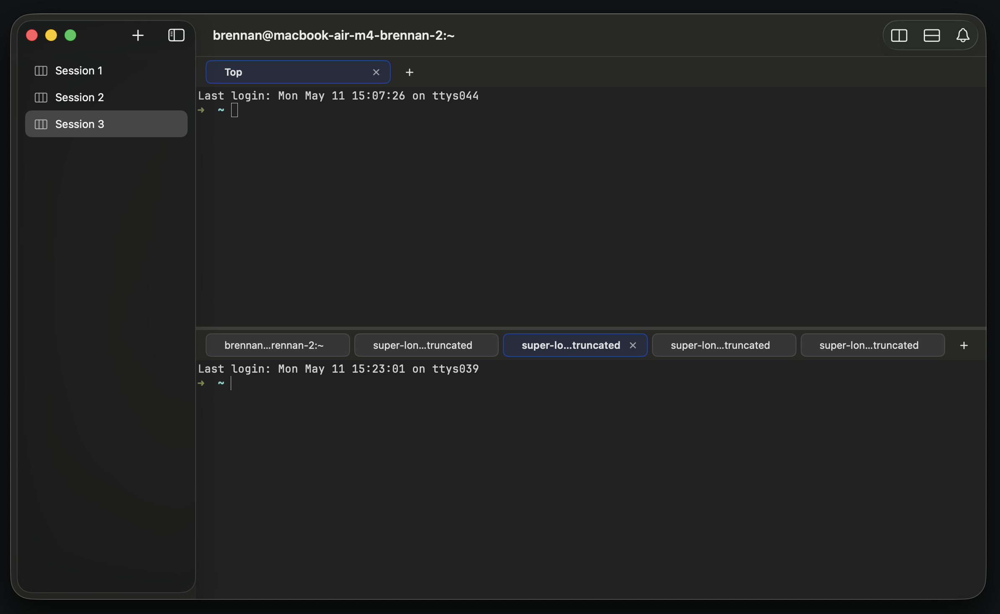

# 0052 — Active pane is not visually distinguishable from inactive panes

| | |
|---|---|
| **Status** | open |
| **Module** | Pane / Split |
| **Platform** | macOS |
| **First seen** | 2026-05-11 |

## Description

With two or more panes on screen, there is no visual signal indicating which pane currently owns keyboard focus (the value of `tree.focusedPaneID`). Every pane renders its tab bar at full opacity, and the *active tab inside each pane* uses the same accent-colored chip highlight regardless of whether that pane is the focused one. The result in the attached screenshot is two chips with the accent-color highlight — one in the top pane (`Top`), one in the bottom pane (`super-lo…truncated`) — and the user can't tell from looking which pane will receive their next `Cmd-D` / `Cmd-T` / arrow-key keystroke.

Per-pane "this is the active tab in this pane" highlighting is correct on its own — each pane has its own `activeTabID` and the chip needs to show that. The missing dimension is **session-level** focus: of these N panes, **which one is the one the keyboard is talking to right now?**

## Steps to reproduce

1. Open a session with two panes (`Cmd-D` once).
2. Observe both panes' tab bars. Both look identical — same chip colors, same border opacity, same backgrounds.
3. There is no way to tell from the visuals alone which pane is the focused one.

## Expected behavior

The focused pane is visually distinct from non-focused panes. Common patterns from other terminal multiplexers / IDEs:

- **Dim non-focused panes** — drop the tab bar background and/or terminal contents to ~60% opacity in non-focused panes; focused pane stays at full opacity.
- **Focused-pane border / outline** — a 2pt accent-colored stroke around the focused pane's frame.
- **Tab chip palette swap** — the focused pane's active chip uses the accent color; non-focused panes' active chips use a neutral gray "this would be active *if* you focused this pane" treatment.
- **Title bar / toolbar highlight** — if a pane has its own toolbar strip, color it.

Pick one (or a small combination) consistently. iTerm2 uses dimming; Terminal.app uses a thin highlighted top border on the focused split; tmux uses a border color difference. Any of these are fine; the bar must be set at "user can answer 'which pane is active?' in well under a second."

The signal must reflect `tree.focusedPaneID` in the current session, and update with no perceptible delay when focus moves (via `Cmd-Option-Arrow`, click-to-focus per `#0051` / `#0053`, or `splitFocusedPane`).

## Actual behavior

Every pane renders identically. The only signal is the system's first-responder ring on the active `TerminalSurfaceView` itself, which is subtle on a dark terminal background and not visible at all once the terminal has any output covering that frame. The tab chip's accent-colored highlight is per-pane (it shows the active tab *within* that pane) and so appears in every pane, defeating its use as a focus indicator.

## Attachments



## Notes

- `tree.focusedPaneID` already exists and is the model-level source of truth. The view layer just needs to consume it.
- Cleanest place to consume it: `SplitNodeView` / `PaneView` already have `tree` in scope. A simple `isFocused: Bool = (tree.focusedPaneID == pane.id)` computed property can drive the dimming/border.
- A small refactor question: should `BattyTabChip` know about pane-focus state so its active-chip rendering changes when the pane is unfocused? Cleaner answer: keep `BattyTabChip` ignorant of pane focus; let `PaneView` apply a `.opacity(isFocused ? 1 : 0.55)` or a `.overlay` border at the pane level. The chip stays a pure presentation component.
- Animation: a 100–150ms ease-in-out on the dim/border transition is comfortable; instant flicks look harsh when the user is rapidly cycling focus with the arrow shortcuts.
- The non-active inactive-pane chip can keep showing the unseen-bell dot — bell salience should NOT be reduced by focus dimming, since the whole point of the dot is to draw attention to *unfocused* tabs.
- Related: `#0051` (click anywhere in pane's terminal to focus it — model write) and `#0053` (click tab chip in non-focused pane to focus it). This issue is the *view* side; those two are the *behavior* side. Together they form "click-to-focus that the user can see."

## Acceptance criteria

- With two panes and focus in pane A, pane A is visually emphasized vs pane B.
- Moving focus to pane B (via `Cmd-Option-Right`, click-to-focus, or `Cmd-D`) flips the emphasis to B with no perceptible delay.
- Per-pane active-tab highlighting still indicates which tab is active *within* that pane (so the user can see which tab will be re-focused when they click into a non-focused pane), but it no longer competes with the session-level "which pane is active" signal.
- The unseen-bell dot on non-focused-pane chips remains visible at full salience.
- Works in both light and dark mode and respects the active Ghostty theme's accent color where applicable.

## Suggested implementation sketch

```swift
// PaneView (or SplitNodeView wrapping it)
private var isFocused: Bool {
    // session is available via env / a wrapper
    session.tree.focusedPaneID == pane.id
}

var body: some View {
    VStack(spacing: 0) {
        SlidingTabBar(...) { ... }
        ZStack { ... }
    }
    .opacity(isFocused ? 1 : 0.55)
    .overlay {
        RoundedRectangle(cornerRadius: 0)
            .strokeBorder(Color.accentColor, lineWidth: isFocused ? 2 : 0)
            .opacity(isFocused ? 0.6 : 0)
            .allowsHitTesting(false)
    }
    .animation(.easeInOut(duration: 0.12), value: isFocused)
}
```

The opacity drop is the primary signal; the border is optional polish. Pick whichever feels right after seeing it.

## Out of scope

- The behavioral fix for "click-to-focus a pane" (tracked in `#0051` for terminal-surface clicks and `#0053` for tab-chip clicks). This issue assumes focus *can* move and only addresses making the current focus *visible*.
- A per-window "which session is the focused session" indicator — the sidebar selection already covers that.
