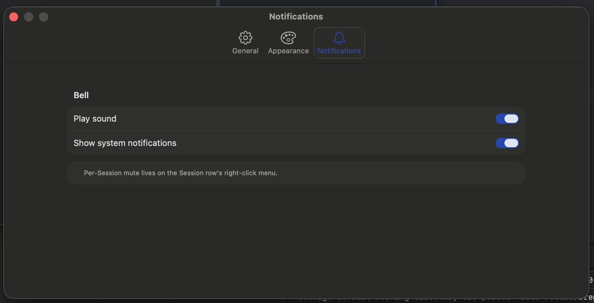

# 0068 — Settings claims per-session mute is in the sidebar context menu, but it isn't

| | |
|---|---|
| **Status** | resolved |
| **Module** | Settings / Sidebar / BellFeed |
| **Platform** | macOS |
| **First seen** | 2026-05-11 |
| **Closed** | 2026-05-11 |
| **Commit** | a7a82be |

## Description

Settings → Notifications has a help row that reads:

> Per-Session mute lives on the Session row's right-click menu.

But `SessionSidebarView`'s context menu only contains **Rename**, **Duplicate**, and **Close** — there's no mute toggle. The Settings copy is making a promise the app doesn't keep.

Two ways to resolve: either add the missing feature (per-session mute via the sidebar context menu) or remove the misleading copy from Settings. Recommend **add the feature** — per-session mute is a real user need (e.g. a session running a noisy build but you don't want to silence every session).

## Attachments



## Steps to reproduce

1. Open Settings → Notifications.
2. Read the bottom help row: "Per-Session mute lives on the Session row's right-click menu."
3. Right-click any session row in the sidebar.
4. **Observed:** menu shows Rename / Duplicate / Close. No Mute item.
5. **Expected:** a "Mute Notifications" / "Unmute Notifications" toggle (item shows the inverse label based on current state).

## Expected behavior

`SessionRuntime` gains a `notificationsMuted: Bool` flag. When `true`:

- Bell sound is suppressed for tabs in that session (sound is per-app today via `Play sound` toggle; per-session overrides to `false`).
- Desktop notifications are suppressed for tabs in that session (currently driven by `Show system notifications` toggle; per-session overrides to `false`).
- The bell feed entries still record (so the unseen badge in the sidebar continues to update; the user can review what happened later).

The sidebar context menu adds an item that toggles `notificationsMuted`. Label flips between "Mute Notifications" and "Unmute Notifications" based on current state.

## Implementation guidance

### Data model

In `BattyKit/Sources/BattyKit/SessionRuntime.swift`, add:

```swift
public var notificationsMuted: Bool = false
```

It's a regular `@Observable` property — sidebar context menu writes, `AppStateStore.postNotification(for:at:)` reads.

### Persistence

The flag should survive across launches per-session. Two paths:

- Add to `LayoutModel.Session` (the Codable model) and serialize via the existing workspace persistence path. With `#0055` defaulting workspace-restore to off, this only matters when restore comes back as an explicit feature; v1 can ship without persistence and we revisit.
- OR: cache the mute state per-session-id in `UserDefaults`. Survives even without workspace restore, but pollutes UserDefaults with session UUIDs.

Recommend the first option — add to `LayoutModel.Session.notificationsMuted` for forward compatibility, even though it won't be read on launch yet. The write path stays simple.

### Sidebar context menu

In `SessionSidebarView.swift`, add to the existing context menu after Duplicate:

```swift
Divider()
Button(session.notificationsMuted ? "Unmute Notifications" : "Mute Notifications") {
    session.notificationsMuted.toggle()
}
```

### Notification gate

In `AppStateStore.swift`, the `postNotification(for:at:)` helper is the single gate for desktop notifications. Add:

```swift
private func postNotification(for entry: BellFeedEntry, at location: BellLocation) {
    guard let notifier else { return }
    guard !location.session.notificationsMuted else { return }
    ...
}
```

For bell **sound**, the path is in libghostty's surface code — there's no easy app-level gate. Document this as a v1 limitation (sound stays governed by the global `Play sound` toggle). The desktop-notification gate is the primary user benefit.

### Sidebar visual

Optional polish: show a small "muted" icon (e.g. `bell.slash`) next to the session title when `notificationsMuted == true`, similar to how the unseen-bell badge already renders in `SessionRow`. Skip for v1 if it complicates the row layout.

## Acceptance criteria

- Right-clicking a session row in the sidebar shows a "Mute Notifications" / "Unmute Notifications" toggle that reflects current state.
- Toggling the menu item flips `session.notificationsMuted`.
- Desktop notifications for any tab inside a muted session are suppressed.
- Bell feed continues to record entries (unseen badge still updates) — mute is about *delivery*, not capture.
- The Settings help row's claim now matches reality.

## Out of scope

- Bell sound suppression per-session (libghostty plays the bell internally; would need a fork change).
- Mute scheduling (e.g. "Mute for 1 hour"). v1 is a binary on/off toggle.
- Per-pane or per-tab mute. v1 is session-level only.
- Visual icon on the muted session row. Optional polish; skip for v1 unless trivial.

## Notes

- The bell feed (`AppStateStore.recordBellTick`, `recordDesktopNotification`) is the single read path for delivering notifications. Gate there.
- The Settings copy ("Per-Session mute lives on the Session row's right-click menu.") lives in `SettingsView.swift` or a Notifications subview — find it and verify it stays accurate once the feature lands.
- Related: `#0055` (workspace restore default off — affects persistence decision for the mute flag).

## Root cause

`SettingsView` advertised a per-session mute feature in its Notifications help row, but the feature was never built. `SessionSidebarView`'s context menu only exposed Rename / Duplicate / Close, and `AppStateStore.postNotification(for:at:)` had no per-session gate.

## Fix

- Added an observable `notificationsMuted` flag to `SessionRuntime`.
- Added a Mute Notifications / Unmute Notifications toggle to the session-row context menu in `SessionSidebarView`. The label flips based on current state.
- Gated `AppStateStore.postNotification(for:at:)` on `location.session.notificationsMuted` so desktop notifications are suppressed for muted sessions while bell-feed capture and unseen badging still run.
- Introduced a `BellNotifying` protocol so tests can substitute a spy for `BellNotifier`. The concrete notifier conforms; `AppStateStore.notifier` now stores the protocol type.
- Added `notificationsMuted` to `LayoutModel.Session` with a custom `init(from:)` that uses `decodeIfPresent`, so legacy `workspace.json` files keep decoding. Wired conversion in both directions through `WorkspaceConversion`.
- Existing Settings copy in `SettingsView` is now accurate; left unchanged.

## Files changed

- `BattyKit/Sources/BattyKit/SessionRuntime.swift` — added observable `notificationsMuted` property and matching init parameter.
- `BattyKit/Sources/BattyKit/SessionSidebarView.swift` — added mute toggle to the session-row context menu after Duplicate, separated by a divider.
- `BattyKit/Sources/BattyKit/AppStateStore.swift` — early-return in `postNotification` when the session is muted; switched the notifier property and init to the new `BellNotifying` protocol.
- `BattyKit/Sources/BattyKit/BellNotifier.swift` — introduced a `BellNotifying` protocol; `BellNotifier` now conforms.
- `BattyKit/Sources/BattyKit/LayoutModel.swift` — added `notificationsMuted` to the `Session` Codable struct with a custom decoder that defaults missing values to `false`.
- `BattyKit/Sources/BattyKit/WorkspaceConversion.swift` — propagated the new flag in both `Session(from: SessionRuntime)` and `SessionRuntime(from: Session)`.
- `BattyKit/Tests/BattyKitTests/SessionMuteTests.swift` — new; covers muted/unmuted desktop notifications and muted-but-still-captured bell ticks using a `SpyBellNotifier`.
- `BattyKit/Tests/BattyKitTests/WorkspaceConversionTests.swift` — added a round-trip test for `notificationsMuted` and a legacy-decode test that strips the field from the JSON.

## Gotchas

- Bell **sound** is played by libghostty internally; there is no app-level surface to gate it. Muting a session therefore only suppresses *desktop notifications* — a bell received in a muted session may still ring locally. Mention this in any UI copy if it expands.
- The mute flag is written to `workspace.json` for forward compatibility, but it isn't read on launch yet because `#0055` keeps workspace restore default-off and the launch path starts fresh. Once an opt-in restore feature exists, mute state will follow automatically.
- Swift's synthesized `Codable` does **not** honour stored-property defaults during decode. `LayoutModel.Session` therefore has an explicit `init(from:)` that uses `decodeIfPresent` for the new field; updating other `Session` fields means keeping that custom decoder in sync.
- `BellNotifier` is now consumed through the `BellNotifying` protocol. Tests that previously hand-rolled a `BellNotifier` substitute can now conform a small spy class to `BellNotifying` instead.
