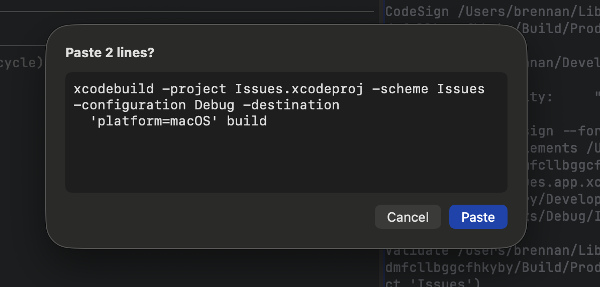

# 0105 — Multi-line paste confirmation prompt is on by default

| | |
|---|---|
| **Status** | open |
| **Module** | Settings |
| **Platform** | macOS |
| **First seen** | 2026-05-14 |

## Description

Cmd-V of any multi-line clipboard content (e.g. a wrapped shell command copied from another terminal) brings up a "Paste N lines?" confirmation sheet before the bytes reach the terminal. Stated reaction: "I hate this. It should just paste without this confirmation."

The behavior is intentional — `SettingsPreference.defaultPasteStrictness` defaults to `PasteStrictness.alwaysOnMultiline`, which prompts whenever the clipboard contains a newline. A user can change this via Settings → Paste Confirmation → "Never confirm", but the default friction is unwelcome.

## Steps to reproduce

1. Copy a multi-line command from anywhere (e.g. the wrapped `xcodebuild ... Debug ...` line shown in the attached screenshot).
2. Click into a Batty terminal pane and press Cmd-V.

## Expected behavior

The clipboard contents are pasted into the terminal immediately, without a confirmation sheet.

## Actual behavior

A "Paste N lines?" sheet appears with Cancel / Paste buttons, requiring an extra click before the paste lands.

## Attachments



## Notes

- Default lives at `BattyKit/Sources/BattyKit/SettingsPreferences.swift:21`:
  ```swift
  public static let defaultPasteStrictness: String = PasteStrictness.alwaysOnMultiline.rawValue
  ```
- Three modes exist (`alwaysOnMultiline`, `onShellMetacharacters`, `never`) — see `SettingsPreferences.swift:85`. Fix is to switch the default to `.never`.
- `onShellMetacharacters` is a tempting middle ground, but it still blocks ordinary multi-line pastes that contain `;` or `&&` (very common in shell one-liners), so it would surprise users who reach for Batty exactly to paste a sequence of commands. `.never` matches Terminal.app / iTerm2 default behavior.
- Existing users who already set `pasteStrictness` in UserDefaults are unaffected — `@AppStorage` only consults the default for first-launch keys.
