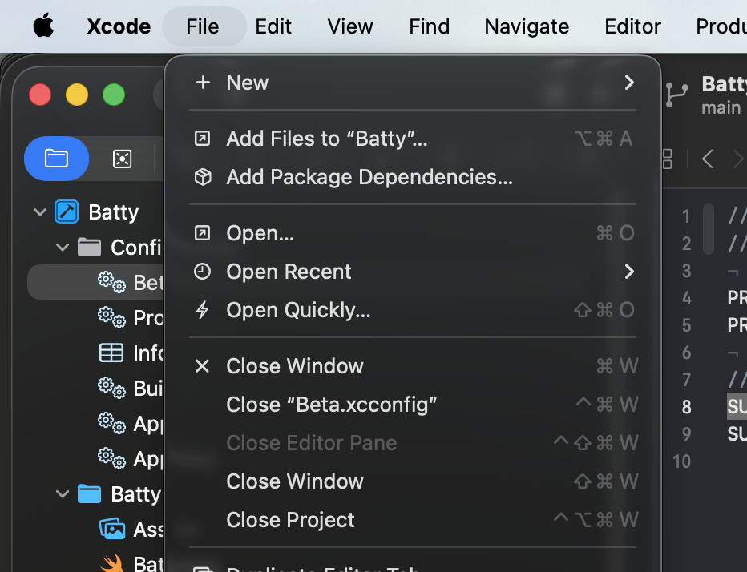

# 0150 — File menu is missing "Open Quickly…" item

| | |
|---|---|
| **Status** | open |
| **Module** | App / Session |
| **Platform** | macOS |
| **First seen** | 2026-05-20 |

## Description

The Open Quickly panel (Cmd-Shift-O) was implemented in #0128 and is reachable via keyboard shortcut, but there is no corresponding menu item in the File menu. Xcode exposes its equivalent as **Open Quickly…** under File with a bolt SF Symbol and the Shift-Cmd-O shortcut. Batty should do the same so the feature is discoverable to users who browse menus before learning shortcuts.

## Expected behavior

The File menu contains an "Open Quickly…" item below "Open Recent", with the `bolt` SF Symbol and the keyboard shortcut Shift-Cmd-O, matching the pattern Xcode establishes.

## Actual behavior

No "Open Quickly…" item exists in the File menu. The panel is only reachable by knowing the keyboard shortcut.

## Attachments

## Notes

- Xcode uses a bolt SF Symbol (`bolt`) for "Open Quickly…" — appropriate because the feature is a fast-jump, not a file-system open.
- The keyboard shortcut (Shift-Cmd-O) is already wired via `ShortcutAction.openQuickly` in `BattyKit/Sources/BattyKit/Shortcuts/ShortcutAction.swift`. The menu item just needs to be added to the `CommandGroup` for File and set the same shortcut so the menu item and shortcut stay in sync.
- Related to #0128 (Open Quickly implementation) and #0151 (SF Symbols across menus).
