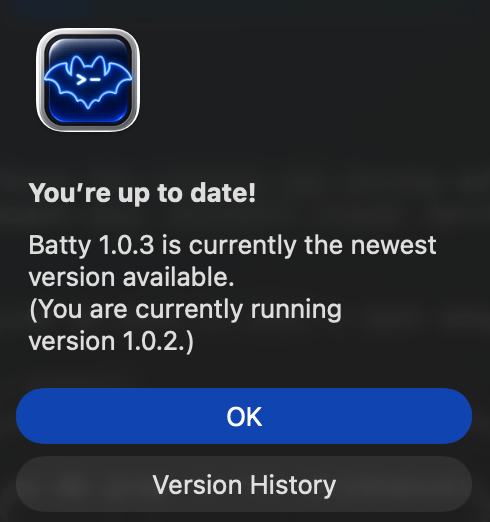

# 0226 — Sparkle reports "You're up to date" on 1.0.3 because the 1.0.3 DMG ships marketing version 1.0.2 and a build number above the appcast

| | |
|---|---|
| **Status** | open |
| **Module** | Build / Website |
| **Platform** | macOS |
| **First seen** | 2026-05-30 |

## Description

A user who installed Batty 1.0.3 sees Sparkle's "You're up to date!" dialog stating *"Batty 1.0.3 is currently the newest version available. (You are currently running version 1.0.2.)"* — a self-contradiction. Two release defects combine to cause it: (1) the shipped `Batty-1.0.3.dmg` was archived **without bumping `MARKETING_VERSION`**, so its `CFBundleShortVersionString` is `1.0.2` (the app reports itself as 1.0.2); and (2) that DMG's `CFBundleVersion` is `20260522`, which is **greater than** the appcast's advertised 1.0.3 `sparkle:version` of `20260521`. Sparkle decides "newest?" on the build number, so the installed app looks newer than the feed → "up to date," while the dialog text prints the marketing strings (feed's 1.0.3 vs host's 1.0.2).

## Long Description

Sparkle's update decision and its dialog text read different fields:

- **Decision** uses `CFBundleVersion` (`sparkle:version`). It selects the newest appcast item and compares its `sparkle:version` to the *host app's* `CFBundleVersion`. If host ≥ feed, it takes the "no update found" branch.
- **Dialog text** is filled from the marketing strings: "newest available" = the top appcast item's `sparkle:shortVersionString` (1.0.3); "currently running" = the host's `CFBundleShortVersionString`.

Hard evidence from the shipped DMGs (mounted and read directly):

| DMG | `CFBundleShortVersionString` | `CFBundleVersion` |
|---|---|---|
| Batty-1.0.0.dmg | 1.0.0 | 1 |
| Batty-1.0.1.dmg | **1.0.0** | **1** |
| Batty-1.0.2.dmg | 1.0.2 | 20260516 |
| Batty-1.0.3.dmg | **1.0.2** | **20260522** |

Live feed (`https://batty.sstools.co/appcast.xml`) advertises for 1.0.3: `sparkle:version="20260521"`, `sparkle:shortVersionString="1.0.3"`.

So a user who installs `Batty-1.0.3.dmg` runs an app that:
- self-reports marketing version **1.0.2** (wrong — `MARKETING_VERSION` not bumped before archive), and
- has build number **20260522 ≥ 20260521** (the feed's newest), so Sparkle sees nothing newer.

Result: the exact screenshot. "1.0.3 newest" (from the feed string), "running 1.0.2" (from the mislabeled host), "up to date" (from the build-number comparison).

Secondary findings worth noting:
- **Feed/DMG build-number mismatch:** appcast 1.0.3 = `20260521` but the actual DMG = `20260522`. The `sparkle:version` is hand-pasted (per `scripts/SPARKLE.md`) and was authored a day off from the real archive. Even if marketing version were correct, anyone who installed the DMG would be one build ahead of the feed.
- **1.0.1 is a byte-identical copy of 1.0.0** (`CFBundleShortVersionString=1.0.0`, `CFBundleVersion=1`, same file size 19649972). This is the documented "1.0.0 → 1.0.1 mistake" referenced in `scripts/preflight.sh`; the 1.0.1 DMG never carried a real 1.0.1 build.

## Steps to reproduce

1. Install `Batty-1.0.3.dmg` (the published release).
2. Note the About box / app reports version 1.0.2 (because the DMG's `CFBundleShortVersionString` is 1.0.2).
3. Choose "Check for Updates…".
4. Sparkle shows "You're up to date!" naming 1.0.3 as newest and 1.0.2 as running.

## Expected behavior

- The 1.0.3 DMG should carry `CFBundleShortVersionString = 1.0.3`.
- The appcast `sparkle:version` for each item should exactly equal the `CFBundleVersion` baked into that release's DMG.
- Each release's `CFBundleVersion` must strictly increase, and the newest feed item's `sparkle:version` must exceed the build number of every prior shipped DMG so Sparkle offers the update.

## Actual behavior

The 1.0.3 DMG reports marketing version 1.0.2 and build `20260522`; the feed advertises 1.0.3 at build `20260521`. Sparkle compares build numbers, finds the installed app (`20260522`) ≥ feed (`20260521`), and reports "up to date" while printing the mismatched marketing strings.

## Attachments

## Notes

Root-cause chain, in order of how to fix:

1. **`MARKETING_VERSION` was not 1.0.3 at archive time.** `Configuration/App.xcconfig` now reads `MARKETING_VERSION = 1.0.3`, but the 1.0.3 DMG's `CFBundleShortVersionString` is `1.0.2` — so the bump landed in the repo *after* the archive was cut (or the archive didn't pick it up). The release process must bump and commit `MARKETING_VERSION` **before** `scripts/release.sh` archives.

2. **`scripts/release.sh` injects `CURRENT_PROJECT_VERSION=$BUILD_NUMBER` (UTC `YYYYMMDD`) at archive time** (`scripts/release.sh:91`), but the `sparkle:version` in `website/appcast.xml` is pasted by hand (`scripts/SPARKLE.md`, `scripts/RELEASE.md` §6). The hand-entered `20260521` didn't match the real archive's `20260522`. The appcast `sparkle:version` should be read out of the built DMG's `CFBundleVersion` rather than typed, to make this class of drift impossible.

3. **Consider tightening `scripts/preflight.sh`** to additionally assert: (a) `MARKETING_VERSION` matches the appcast item's `sparkle:shortVersionString` about to be released, and (b) the appcast's newest `sparkle:version` equals the actual `CFBundleVersion` inside the DMG it points to. The existing collision gate (`preflight.sh:146`) only checks the date-vs-feed ordering, not DMG-vs-feed consistency or the marketing-version bump.

Remediation for already-published 1.0.3: re-cut the 1.0.3 DMG with `MARKETING_VERSION = 1.0.3` and a build number greater than `20260522`, update the appcast `sparkle:version` to match the rebuilt DMG, re-sign, and re-upload. Users who already installed the mislabeled 1.0.3 will only get the corrected build once the feed's `sparkle:version` exceeds `20260522`.

Verified by mounting each `website/downloads/Batty-*.dmg` and reading `CFBundleShortVersionString` / `CFBundleVersion`, and by fetching the live appcast — both on 2026-05-30.
