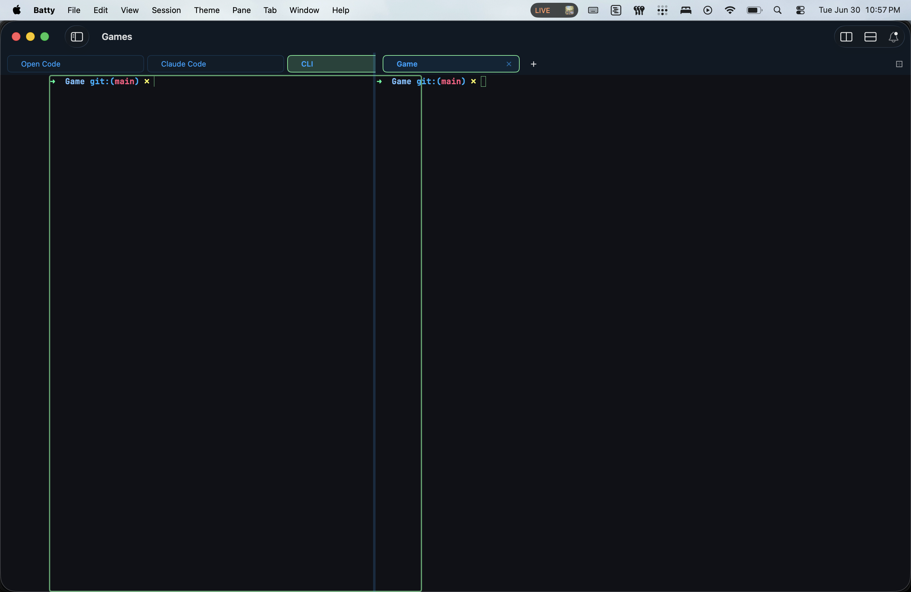
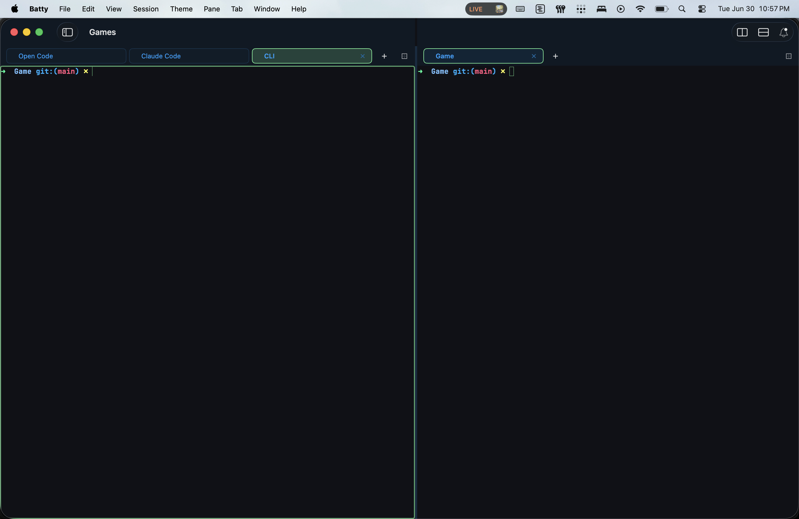

# 0253 — Active-pane highlight renders incorrectly when a pane has tabs open

| | |
|---|---|
| **Status** | resolved |
| **Module** | Pane / Tabs |
| **Platform** | macOS |
| **First seen** | 2026-06-30 |
| **Closed** | 2026-07-01 |
| **Branch** | issue/0253 |

## Description

In a split with tabs open in a pane, the active-pane highlight (green border) draws incorrectly — the border is misaligned around the active pane and a stray green line/edge appears near the split divider, with the two panes' tab bars appearing to run together. Not observed when panes have no tabs.

## Resolution notes

> 🟢 Resolved 2026-07-01 — a multi-tab pane's tab bar was overflowing its allocated width and bleeding into the sibling pane; clipped the pane body to its bounds, corrected the tab-width budget, and moved the accent border to frame the whole pane.

**Needs your visual sign-off.** This is a SwiftUI layout fix that can't be verified headlessly — build and unit tests pass, but confirm the render in a split with several tabs open before closing. Marked `resolved`, not `closed`.

## Long Description

Two side-by-side panes in the "Games" session, the left pane carrying multiple tabs (`Open Code`, `Claude Code`, `CLI`, `Game`). The active-pane green highlight is meant to frame exactly the active pane, but with tabs present it renders wrong:

- **Screenshot 1 (bad state):** the tab bars of the two panes appear merged into one row, the active-pane green border does not cleanly bound a single pane, and there's a stray green vertical segment near the split boundary. The `CLI` tab shows the active-green treatment while the surrounding border/divider don't line up with it.
- **Screenshot 2 (moments later, closer to correct):** each pane has its own tab bar and the left pane shows a clean green active border — included for contrast to show the intended rendering.

The user reports this only happens **when tabs are open in a pane** — it wasn't seen without tabs.

## Steps to reproduce

1. Open a session and create a horizontal split (two panes side by side).
2. In one pane, open several tabs (e.g. `Open Code`, `Claude Code`, `CLI`, `Game`).
3. Switch the active pane / active tab.
4. Observe the active-pane highlight.

## Expected behavior

The active pane shows a single clean highlight border framing exactly that pane, and each pane's tab bar stays within its own pane bounds — regardless of how many tabs are open.

## Actual behavior

With tabs open, the active-pane highlight is misdrawn: the border is misaligned, a stray green line/edge appears near the split divider, and the panes' tab bars appear to overlap/merge. State is inconsistent between redraws (screenshot 1 vs screenshot 2).

## Attachments

## Notes

- Likely lives in the active-pane highlight/border rendering and how it composes with the per-pane tab bar layout — the defect is specific to the tabs-present case, so the interaction between the tab bar and the pane's highlight frame is the prime suspect.
- Relevant guides for whoever picks this up: `docs/view-hierarchy.md` (model → SwiftUI tree + persistent terminal host), `docs/terminal-pane-requirements.md` (pane body / z-order constraints), and `docs/swiftui-observation-rules.md` (focus/selection-driven state — the highlight tracks the active pane, so a focus/geometry-origin write could be involved). The inconsistency between the two screenshots hints at a layout/observation timing issue rather than a purely static drawing bug.

## Root cause

Not the border-drawing code itself — a **tab-bar width overflow** that dragged the border with it. In `PaneView`, the per-pane row is an `HStack` of `SlidingTabBar` + (when the pane has siblings) a `paneDragHandle`. `chipMaxWidth` budgeted chip widths against the full `paneWidth` minus a static bar-chrome constant, but did **not** subtract the drag handle's 30pt (22pt icon frame + 8pt trailing padding) that shares the same HStack. So the computed chip widths were too large; `SlidingTabBar`'s inner chip `HStack` carries `.fixedSize(horizontal: true)`, so it returns its ideal (too-wide) content width and **overflowed the bar's allocated frame**. With no clip on the pane body, the overflow bled into the adjacent pane — the "merged tab bars." The accent border overlays lived on the inner `ZStack` (terminal region only), so with the tab row overflowing, the border's right edge no longer lined up with the pane/divider — the "misaligned border" and "stray green segment near the divider." The screenshot-to-screenshot flicker was `paneWidth` transiently reading a stale/pre-split value before the geometry settled, amplifying the overflow.

## Fix

All in `PaneView.swift`, minimal and layout-only:
- **Correct the width budget:** `chipMaxWidth` now subtracts a named `dragHandleWidth = 30` when `hasSiblingPanes`, so chips are sized to the width `SlidingTabBar` actually receives (no more overflow of the inner `fixedSize` HStack).
- **Clip the pane body:** added `.clipped()` to the outer pane `VStack` so the tab row can never bleed into the sibling pane. `.clipped()` is a CALayer mask (not an opacity buffer), so it does **not** reintroduce the `#0135` off-screen-buffer seam.
- **Frame the whole pane:** moved the four accent-border overlays (drag-hover, bell-flash, focus border, pane-swap drop zone) and the focus `.animation` from the inner `ZStack` (terminal-only) to the outer `VStack`, so the highlight bounds the entire pane (tab bar + terminal), applied after `.clipped()` so the stroke isn't clipped.

## Review

Reviewed by Opus (claude-opus-4-8) — **approved, first pass**. The crux — `.clipped()` interacting with the persistent AppKit terminal host — was confirmed safe: per `docs/view-hierarchy.md`, the live `AppTerminalView` is **not** a SwiftUI descendant of `PaneView` (it's hosted at `SessionDetailView` level and positioned by `TerminalHostStore` at the AppKit layer, above the SwiftUI chrome), so the clip masks only the tab bar + `Color.clear` placeholder — it cannot clip/mis-size the terminal surface or its Metal layer, doesn't alter the `PaneFramePreferenceKey`/`frameInSession` geometry (a rasterization mask, not a layout change), and introduces no `#0143`-style hit/drag barrier over the terminal (pointer/keyboard/IME/file-drop unaffected). `dragHandleWidth = 30` verified against `paneDragHandle`; single-pane / no-tabs paths unchanged.

## Verification

- `scripts/build.sh unit` — **399 tests in 50 suites passed, `** TEST SUCCEEDED **`** (baseline unchanged; the fix is SwiftUI layout, not unit-testable headlessly).
- `scripts/build.sh` — `** BUILD SUCCEEDED **`.
- **NOT verified headlessly (user sign-off):** the actual render. Confirm in a horizontal split with several tabs open in one pane that (a) each pane's tab bar stays within its pane, (b) the active-pane green border cleanly frames one pane, and (c) no stray green segment appears near the divider.

## Files changed

- `BattyKit/Sources/BattyKit/Views/PaneView.swift` — `dragHandleWidth` constant + `chipMaxWidth` deduction; `.clipped()` on the pane `VStack`; relocated the four border overlays + focus `.animation` from the `ZStack` to the `VStack`.

## Gotchas

- **The border bug was really a layout bug.** The accent-border code was correct; it just framed the wrong region because the tab row overflowed. When touching pane chrome, check tab-bar width budgeting (`chipMaxWidth` vs the drag handle) before suspecting the border overlays.
- **`.clipped()` is safe here only because the terminal isn't a SwiftUI child of `PaneView`.** If the terminal host architecture ever changes so the surface becomes a SwiftUI descendant, this clip would start masking the terminal — revisit then (see `docs/view-hierarchy.md`).
- **Do not reintroduce per-pane opacity** to indicate focus (the `#0135` trap): explicit `<1` opacity forces an off-screen buffer whose edges composite as thin seams at pane boundaries. Use the accent border (and `.clipped()`, which is a mask, not a buffer).
- Cosmetic, non-blocking: the clip is rectangular while the border is `RoundedRectangle(cornerRadius: 4)`, so content corners may peek a hair outside the rounded stroke; and the focus `.animation` now covers the whole pane VStack (tab-chip color changes may animate over 0.12s). Neither affects the terminal (placed by the host store, not SwiftUI-animated).

## Work log

| Date | Model | Input | Output | Cache read | Cache write | Cost |
|---|---|---|---|---|---|---|
| 2026-07-01 | claude-sonnet-4-6 | 1,010 | 32,558 | 1,475,081 | 362,420 | $2.29 |
| 2026-07-01 | claude-opus-4-8 | 3,936 | 1,126 | 670,916 | 56,558 | $0.74 |

**Total: $3.03**
