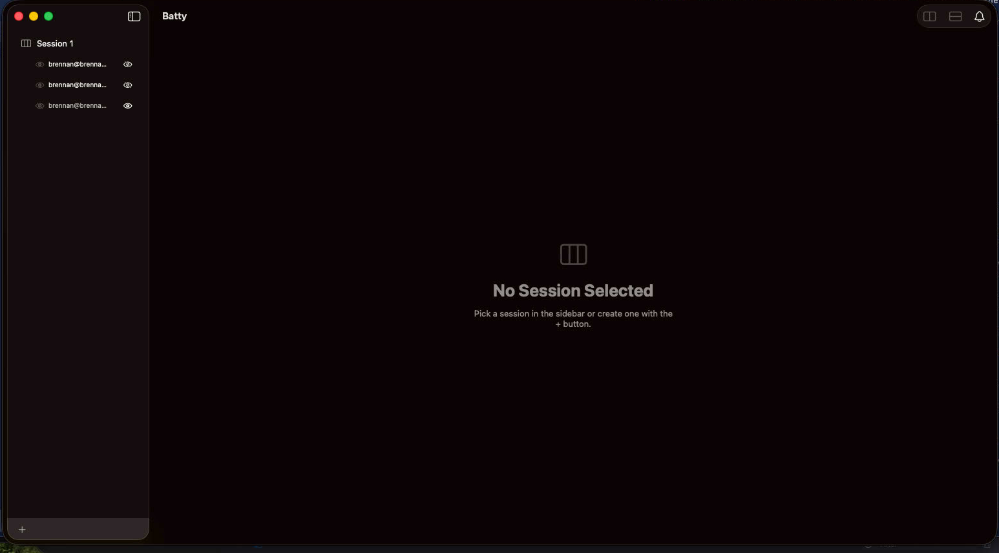

# 0258 — Sidebar pane rows leak pane ids into session selection (No Session Selected) and show duplicate eye indicators

| | |
|---|---|
| **Status** | in-progress |
| **Module** | Sidebar / Session / Pane |
| **Platform** | macOS |
| **First seen** | 2026-07-07 |

## Description

Regression cluster from the #0256 sidebar pane tree, observed live (see screenshot and log):

1. **The app reaches a "No Session Selected" state that should be impossible.** With one session ("Session 1", three panes) the detail area shows the No Session Selected placeholder while the sidebar still lists the session and its panes. The log shows the cause directly:

   ```
   selectedSessionID changed: 320B9A05-… → D861187E-…   ← D861187E is a PANE id
   applyActiveSessionTheme: no selected session
   allPanes.count changed → 0; re-applying theme
   focus skipped: tab 5B532DAA-… had no visible AppTerminalView after 5 retries
   ```

   `D861187E…` and `0C8011FD…` appear elsewhere in the same log as **pane** ids (`focusPane: 0C8011FD-… -> 96640D63-…`). Pane ids are being written into `selectedSessionID`.

2. **Duplicate hide/show indicators on each sidebar pane row.** A leading `eye`/`eye.slash` status icon *and* a trailing eye toggle button — two eyes per row.

3. **Requirement (re-stated from #0256): a session must always have ≥ 1 visible terminal.** The guard exists (`WindowRuntime.hidePane` refuses the last visible pane; both eye buttons disable) and is covered by `PaneHideTests` (`cannotHideLastVisiblePane`, `…WhenOthersAreHidden`, `windowRuntimeRefusesHidingLastVisiblePane`). The apparently-empty window in the screenshot is item 1, not a guard failure — but the invariant gains a second layer here: with selection validated, a window with sessions can never render the empty state at all.

## Root cause (item 1)

`SessionSidebarView` binds `List(selection: $windowRuntime.selectedSessionID)` (a `UUID?`). The pane rows added by #0256 carry a code comment claiming they are "non-selectable — they carry no List tag", but on macOS **`List` derives an implicit selection value from each row's `ForEach` identity even without an explicit `.tag()`**. The pane `ForEach` is keyed by `pane.id` — a `UUID` that type-matches the selection binding — so clicking a pane row (including near its eye button) writes the *pane's* id into `selectedSessionID`. No layer validates the write; `selectedSession` finds no matching session → placeholder UI, `applyActiveSessionTheme: no selected session`, `allPanes.count → 0`, and focus retries that fail because the session content is unmounted. Clicking empty sidebar space (or Esc) can likewise write `nil`.

## Fix plan

- **Validate the selection write path:** route the sidebar `List` selection through `WindowRuntime.setSelectedSession(id:)` — rejects ids that aren't sessions of this window and rejects `nil` while sessions exist; idempotent on equal values (equal-value writes on `@Observable` still notify, #0229). Invariant: `selectedSessionID` is `nil` iff `sessions` is empty.
- **Make pane rows genuinely non-selectable:** `.selectionDisabled(true)` on each pane row.
- **Give pane rows a deliberate tap action** (event-origin): select the owning session, un-hide the pane if hidden (#0256's "selecting a hidden pane's row restores it"), focus the pane.
- **Single eye per row:** drop the leading status icon; the trailing button becomes the one control and shows **state** (`eye` = visible, `eye.slash` = hidden), layers-panel style. Hidden rows keep the secondary text color.
- **≥1 visible:** no code change needed (guard verified present + tested); selection validation closes the "empty window" presentation of the bug.

## Attachments



## Relation

- Regression from **#0256** (sidebar pane tree + eye toggle); the ≥1-visible requirement restated from #0256's "Layout / split impact".
- Selection-flow rules per `docs/swiftui-observation-rules.md` (validated-binding set runs event-origin; no writes from view construction).
- The #0257 CLI's `session focus` / cross-session targeting will rely on the same "selection must be a real session id" invariant.
