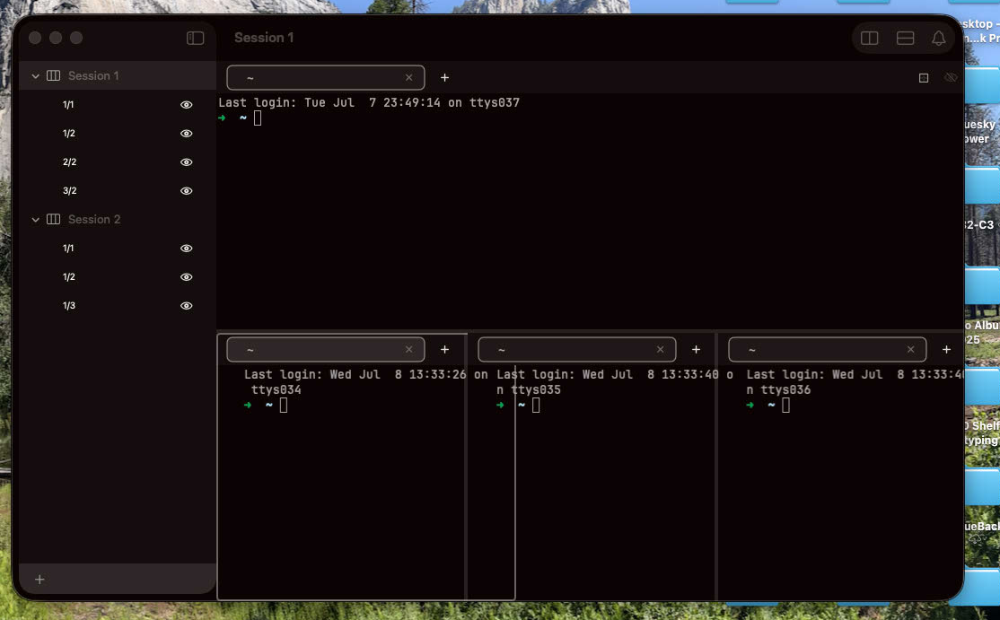

# 0261 — Active-pane highlight is drawn with the wrong geometry and does not align with pane boundaries

| | |
|---|---|
| **Status** | resolved |
| **Module** | Pane / Split |
| **Platform** | macOS |
| **First seen** | 2026-07-08 |
| **Closed** | 2026-07-08 |
| **Branch** | issue/0261 |

## Description

The active-pane highlight outline is drawn with the wrong geometry: its lines do not coincide with the actual pane edges. In a session with a top pane spanning the full width and a bottom row of three side-by-side panes, the highlighted rectangle is visibly offset from the real pane borders and divider positions — the highlight's vertical lines fall inside neighboring panes rather than on the boundaries of the focused pane.

User report:

> "See how the lines for the highlight do not match the active pane? However the highlights are being drawn does not match the geometry of the panes. This is a problem and we need to fix it."

## Resolution notes

> 🟢 Resolved 2026-07-08 — panes now clamp to the size the split layout actually allots them, so the focus highlight (and dividers, neighbor panes, and terminal placement) line up with the real pane boundaries.

Visual pixel-alignment in the running app is the user's sign-off — see Gotchas.

## Root cause

`SplitLayout` (the custom `Layout` in `SplitContainerView.swift`) only *proposes* a width/height to each pane via `place(at:proposal:)`; SwiftUI treats a `Layout`'s proposal as a hint, not a hard size. `SlidingTabBar`'s tab-chip row uses `.fixedSize(horizontal: true)` with a 60pt `chipMinWidth` floor, so a pane too narrow for its tab count refuses to shrink — its outer `VStack` reports an ideal width *wider* than the slot `SplitLayout` allotted. The divider and next pane are still placed at the originally-computed positions, so `PaneView`'s focus-highlight `.overlay` (and the sibling drag-hover, bell-flash, and swap-target overlays that share the shape) inherited the oversized frame and drew past the true divider — ~55px past in the reported screenshot. The earlier #0253 `.clipped()` masked the *drawing* but is layout-transparent, so it never corrected the frame the overlays tracked.

## Fix

Publish each pane's exact allotted size and clamp the pane to it before overlays/clipping run:

- `SplitContainerView.swift`: `DraggableSplitView.body` wraps `SplitLayout` in a `GeometryReader` (which always accepts the size it's given, unlike a `fixedSize`-refusing child), recomputes the same left/right length math `SplitLayout.placeSubviews` uses, and publishes the per-child allotment via a new internal `EnvironmentValues.paneAllottedSize: CGSize?`.
- `PaneView.swift`: reads `@Environment(\.paneAllottedSize)` and applies `.frame(width:height:alignment: .topLeading)` to its `VStack` *before* `.clipped()`/`.overlay()`. This reports the clamped size upward, so `SplitLayout`, the divider, the neighbor pane, the overlays, and the `PaneFramePreferenceKey`/terminal placement all agree on the pane frame. `.topLeading` (not the default `.center`) makes any residual tab-strip overflow clip off the trailing/bottom edges only, preserving the leading/active tab. `allottedSize` is `nil` for a single unsplit pane (behavior unchanged); the fix applies recursively to nested splits since each `DraggableSplitView` re-measures and re-publishes its own allotment.

## Review

Reviewed by claude-opus-4-8 over two rounds. Round 1 confirmed the root-cause diagnosis and the clamp mechanism were sound (mechanism addresses the root, not just the overlay; nested splits handled; no observation-rule/terminal-host violations) but requested one blocking change: the clamp `.frame` defaulted to `.center` alignment, which would center-clip an overflowing tab strip and lose the leading/active tab in this issue's own scenario. Round 2 applied `alignment: .topLeading` (and dropped a needless `public`), and a fresh reviewer approved.

## Verification

`scripts/build.sh` — BUILD SUCCEEDED. `scripts/build.sh unit` — 450 tests in 55 suites passed (all pre-existing BattyKitTests; no failures/skips). Re-run independently by the round-2 reviewer with the same result. No new unit tests were added: `BattyKitTests` has no SwiftUI-rendering harness (no `ImageRenderer`/`NSHostingView`) and `SplitLayout`/`DraggableSplitView` are private view types, so there was no idiomatic place for a fast headless test of this rendering behavior; the implementer instead validated the failure mode and the fix mechanism with a standalone offscreen `ImageRenderer` harness (not committed). Visual pixel-alignment in the running app was NOT verified (app not launched, per the "never restart the app" rule) and is the user's sign-off.

## Files changed

- `BattyKit/Sources/BattyKit/Views/SplitContainerView.swift` — `DraggableSplitView.body` wraps `SplitLayout` in a `GeometryReader`, computes each child's allotted size, and publishes it via the new internal `EnvironmentValues.paneAllottedSize`.
- `BattyKit/Sources/BattyKit/Views/PaneView.swift` — reads `paneAllottedSize` and clamps the pane `VStack` with `.frame(width:height:alignment: .topLeading)` before `.clipped()`/`.overlay()`, anchoring the highlight (and terminal frame) to the allotted size.
- `issues/0261.md` — status, resolution sections, work-log rows.

## Gotchas

- **Visual sign-off pending (user).** The fix is proven mechanism-correct (build + all unit tests pass; offscreen render harness confirmed the clamp) but pixel-perfect alignment across single pane, horizontal row, vertical stack, and the mixed screenshot layout needs a look in the running app. Marked `resolved`, not `closed`.
- **First-layout-pass transient.** On the very first layout pass (before `GeometryReader` has a real size) `paneAllottedSize` is `nil` and the pane renders unconstrained for that one frame, then snaps to the clamp once geometry resolves. The `guard main > 0, crossLength > 0 else { return nil }` bootstrap is deliberate — it avoids a collapse-to-zero — and the transient is invisible in practice.
- **Duplicated length math (known, accepted).** `DraggableSplitView.body` recomputes the same left/right length math as `SplitLayout.placeSubviews`; the two copies could drift if the split algorithm changes. Left as-is deliberately (reviewer INFO, low-risk guidance) to avoid destabilizing the fix — a shared helper would be the clean follow-up if the split math is ever touched.

## Steps to reproduce

1. Create a session with a split layout — e.g. a top pane spanning the width and a bottom row of three side-by-side panes (as in the attached screenshot: sidebar positions 1/1, 1/2, 2/2, 3/2).
2. Focus one of the panes so the active-pane highlight draws.
3. Compare the highlight outline against the pane's actual edges and the split dividers.

## Expected behavior

The active-pane highlight outlines exactly the focused pane: its stroke sits on the pane's real boundaries, flush with the split dividers and window edges around that pane.

## Actual behavior

The highlight rectangle is offset from the pane's real geometry — its lines cut through neighboring panes or float away from the dividers, so it does not read as a border on the focused pane.

## Attachments

## Notes

- The focused-pane highlight is one of the `RoundedRectangle(...).strokeBorder(...)` overlays in `BattyKit/Sources/BattyKit/Views/PaneView.swift` (the `hasSiblingPanes && isPaneFocused` overlay around lines 223–229; the sibling drag-hover, bell-flash, and swap-target overlays use the same shape and would share any geometry bug).
- The likely mismatch is between the frame the SwiftUI overlay is applied to and where the terminal actually renders: pane frames are reported via a preference key and the persistent AppKit terminal host (`BattyKit/Sources/BattyKit/Views/TerminalHostView.swift`) positions the terminal `NSView`s from those stored frames. If the overlay attaches at a different level of the view tree than the frame the host uses (e.g. before/after padding, tab strip, or safe-area adjustments), the stroke lands offset from the visible terminal content.
- Split geometry (pane sizes, 4 pt divider thickness) is computed by `SplitLayout` in `BattyKit/Sources/BattyKit/Views/SplitContainerView.swift`; check whether the highlight's coordinate space accounts for divider thickness and nested-split offsets the same way the layout does.
- See `docs/view-hierarchy.md` and `docs/terminal-pane-requirements.md` before changing pane overlays — the AppKit z-order constraint for the terminal host is binding.

## Work log

| Date | Model | Input | Output | Cache read | Cache write | Cost |
|---|---|---|---|---|---|---|
| 2026-07-08 | claude-sonnet-5 | 130 | 97,575 | 8,166,061 | 201,801 | $3.11 |
| 2026-07-08 | claude-opus-4-8 | 4,376 | 21,238 | 766,348 | 77,552 | $1.42 |
| 2026-07-08 | claude-sonnet-5 | 765 | 2,176 | 716,247 | 112,005 | $0.45 |
| 2026-07-08 | claude-opus-4-8 | 4,072 | 3,417 | 72,021 | 22,939 | $0.29 |

**Total: $5.27**
