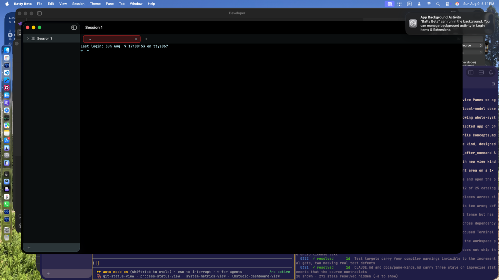
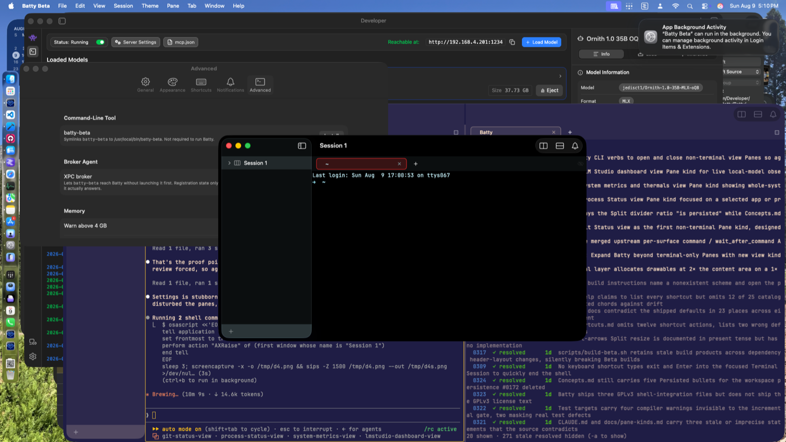

# 0333 — Non-terminal Panes created via batty pane split --view are invisible while the terminal Pane fills the entire window

| | |
|---|---|
| **Status** | open |
| **Module** | Pane |
| **Platform** | macOS |
| **First seen** | 2026-08-09 |

## Description

The `batty pane split --view <kind>` verb that #0315 landed works end to end at the model and CLI layers, but the resulting typed Panes never appear on screen. In a signed Beta build (squash `7eec59f` on `main`, XPC broker registered), two typed Panes were created, `batty list` reported `panes=3` with the correct topology, both typed leaves reported `isHidden=false` — and the window still shows a single terminal Pane occupying the entire content area. The failure is in the view layer; everything upstream of it checks out.

Notably, the terminal Pane fills the *whole* window, not just its allotted 33% share with blank space beside it. `SplitLayout.placeSubviews` clamps each arm to its ratio-derived length regardless of what the children render, so if the split tree had re-laid-out, the terminal leaf would be a third of the width even if its typed siblings drew nothing. That the terminal still spans the full width suggests the on-screen view tree may never have re-rendered over the new split topology at all (hypothesis — see Notes).

This is also the concrete argument for the manual checklist #0315 recorded as owed and unrun: **1025 unit tests pass, and none of them render a view.** #0315's suite covers the model, the Codable decode, the wire payload, the CLI, and the kind gating — all of which are correct. The one thing no unit test could cover is whether the Pane actually appears, and that is exactly what broke. `docs/pane-kinds.md` §2 specifies the `PaneView.body` kind-switch; `docs/terminal-pane-requirements.md` §6's manual checklist is recorded in #0315's resolution as owed and not performed. This bug is evidence that obligation is real, not ceremonial.

## Steps to reproduce

1. Launch a signed Beta build with the XPC broker registered.
2. `batty pane split --view git-status` — returns a new pane id (observed `0938EFE5-…`), exit 0.
3. `batty pane split --view system-metrics` — returns a new pane id (observed `B9D5E029-…`), exit 0.
4. `batty list` — reports `panes=3`.
5. `batty list --json` — walk the topology: a horizontal split at ratio 0.33 with the terminal leaf (`034EB66F`, `tabs=1`) on the left, and a nested horizontal split at ratio 0.50 containing the two typed leaves (`0938EFE5` and `B9D5E029`, both `tabs=0`, both `isHidden=false`).
6. Look at the window. Resize it to 1700×900 to rule out a too-small-to-see artifact.

## Expected behavior

The window shows three Panes: the terminal on the left at a third of the width, and the Git Status and System Metrics placeholder views (`PaneContentPlaceholderView`, each announcing its kind and that the design is not yet approved) splitting the remaining two thirds.

## Actual behavior

Only the single terminal Pane is visible, filling the entire window content area. The two typed Panes render nothing, at any window size. The model, split tree, wire payload, and CLI are all correct; the Panes simply never appear.

## Attachments

## Relation

- **Caused by #0315** — landed the `PaneView.body` kind-switch, `nonTerminalBody`/`PaneContentPlaceholderView`, and the `batty pane split --view <kind>` verb (squash `7eec59f`).
- **Blocks #0304** — the first real non-terminal view (Git Status) cannot be seen until typed Panes render at all.
- **Related: #0331** — the menu affordance for creating typed Panes is downstream of this same rendering path.

Spec references: `docs/pane-kinds.md` §2 (the kind-switch this bug lives behind), `docs/terminal-pane-requirements.md` §6 (the manual checklist that would have caught it, recorded as owed in #0315's resolution).

## Notes

All of the following was checked against current `main` source before filing. Three candidate causes were considered and **none survived a source read as stated**; what remains are hypotheses, marked as such.

**Ruled out by source:**

- *"`PaneContentPlaceholderView` has no intrinsic size and collapses to zero"* — contradicted. It ends in `.frame(maxWidth: .infinity, maxHeight: .infinity)` (`BattyKit/Sources/BattyKit/Views/PaneView.swift`, `PaneContentPlaceholderView.body`), and `PaneView.body` hard-clamps to `allottedSize`, which `DraggableSplitView` supplies for both arms regardless of kind. Even a zero-size child would not let the sibling absorb the space: `SplitLayout.placeSubviews` places by ratio, not by child-reported size.
- *"`SplitContainerView` sizes children from terminal-specific geometry and gives a non-terminal leaf nothing"* — contradicted. `SplitContainerView`/`SplitNodeView`/`SplitLayout` (`BattyKit/Sources/BattyKit/Views/SplitContainerView.swift`) are entirely kind-agnostic; nothing there consults `TerminalHostStore` or pane kind. Geometry flows the other way: `TerminalPlaceholderView` is a probe that *reports* frames to `TerminalHostStore`; a non-terminal Pane simply has no probe, by design.
- *"The kind-switch returns an empty branch"* — contradicted. The `switch pane.kind` in `PaneView.body` is exhaustive; `.gitStatus`, `.processStatus`, `.lmStudioDashboard`, and `.systemMetrics` all route to `nonTerminalBody`, which unconditionally builds a header row plus `PaneContentPlaceholderView`. No path yields `EmptyView`. The hidden-leaf collapse in `SplitNodeView` (`pane.isHidden` → zero-size `Color.clear`) does not apply either: both typed leaves report `isHidden=false`.

**Open hypotheses (unverified — do not treat as findings):**

1. **The SwiftUI view tree never re-laid-out over the new split topology.** The strongest signal is the screenshot itself: the terminal spans the full window width, not the 33% that `SplitLayout` would clamp it to if the split had rendered. That points at the observation path — e.g. the on-screen `SplitContainerView`'s read of `tree.root` not re-firing after the XPC-driven mutation, or the mutation reaching a `SplitTree` instance other than the one the visible `SessionDetailView` is observing. Worth confirming which actor context `AppXPCService`'s call into `AppStateStore.shared.splitPane` (`BattyKit/Sources/BattyKit/XPC/AppXPCService.swift`, around line 108) actually executes on, and whether `@Observable` change tracking integrates with SwiftUI from there.
2. **Stale terminal-host placement covering the SwiftUI content.** The terminal's pixels come from an AppKit subview of `TerminalHostView` whose frame is driven by `TerminalPlaceholderView`'s geometry probe; if the probe never re-reported after the split, the terminal NSView would retain its full-window frame. On its own this is the weaker hypothesis — `TerminalHostInstaller` sits *below* the SwiftUI siblings in `SessionDetailView`'s `sessionStack` ZStack, so a stale terminal frame should not hide placeholder text drawn above it — but it becomes consistent with the screenshots if hypothesis 1 also holds (no re-layout → no new placeholder views *and* no updated placement, one coherent story).

Whoever picks this up should reproduce with the same XPC demo, then instrument whether `SplitNodeView` ever executes over the three-leaf tree in the live window.
