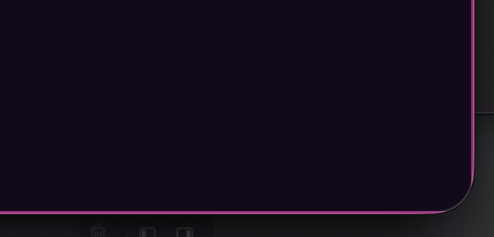

# 0339 — The focused Pane highlight is clipped square at the window's rounded corners instead of following them

| | |
|---|---|
| **Status** | open |
| **Module** | Pane / Window |
| **Platform** | macOS |
| **First seen** | 2026-08-20 |

## Description

A macOS window has rounded corners. The accent stroke that marks the
focused Pane is a `RoundedRectangle(cornerRadius: 4)` drawn on the Pane's
own rectangle, so at a Pane that reaches a window corner the stroke runs
into a near-square corner that lies outside the window's much larger
rounded mask. The window mask removes that part of the stroke, and the
highlight simply stops short on both sides of the corner, leaving a bare
arc where the outline should continue.

User report (verbatim): "In a Mac app window there are rounded corners.
The line which highlights the selected pane is being cut out on these
corners. It would be better to match that corner. See this image as a
reference. If you can get the window corner radius to match that is best."

The preferred outcome is the highlight following the window's actual
corner radius. Approximating that radius with a constant is an acceptable
fallback — see Notes, where the runtime-API question is investigated.

## Steps to reproduce

1. Open a Session and split it so it has at least two Panes — the focus
   highlight is gated on `hasSiblingPanes` (`PaneView.swift:141`), so a
   single unsplit Pane never draws one.
2. Arrange the Split so one Pane reaches a bottom corner of the window.
3. Focus that Pane.
4. Look closely at the window corner nearest that Pane.

## Expected behavior

The accent outline stays continuous around the window's rounded corner,
tracking the same curve the window content is masked to, so the focused
Pane reads as fully outlined.

## Actual behavior

The outline runs along the straight edges and stops where the window's
corner curve begins. Both the vertical and the horizontal run terminate
abruptly, and the corner arc between them carries no accent color at all.

## Attachments

### What the attachment actually shows

The image is an unlabeled 608x292 screenshot at 144 dpi — a 2x Retina
capture, so 304x146 pt of screen. It is a close-up of the bottom-right
corner of a Batty window against the desktop, with a sliver of the Dock
visible at the bottom left.

Measured from the pixels rather than eyeballed:

- The Pane fill is a very dark purple. Its right edge sits at x ~= 579 px
  and stays straight down to y ~= 228 px, then curves inward, reaching
  x ~= 546 px at y = 259 px. The bottom edge is at y ~= 261 px. That
  curve is the window's own corner mask; the Pane fill follows it
  correctly.
- The magenta accent line runs down the right edge and stops at
  y = 228 px. The magenta line along the bottom edge stops at
  x = 548 px. Between those two points there is no magenta at all — only
  a dark, unhighlighted edge.
- The missing arc therefore measures roughly 33 px tall by 35 px wide,
  which at 2x is about 16.5 x 17.5 pt.

So the image depicts the **current bug**, not the desired result: the
highlight is absent across the corner. It is worth stating plainly that
the image carries no annotation saying so — this reading comes from the
measurements above.

## Notes

### Where the highlight is drawn

`BattyKit/Sources/BattyKit/Views/PaneView.swift` stacks four accent
strokes on the Pane body, all built from the same shape:

- lines 125-131 — file-drop hover stroke, `RoundedRectangle(cornerRadius: 4)`
  `.strokeBorder(accentColor, lineWidth: 2)`.
- lines 132-137 — bell-flash stroke, same shape and width.
- lines 138-144 — the focus highlight, same shape and width, at
  `opacity(hasSiblingPanes && isPaneFocused ? 0.6 : 0)`. This is the one
  in the report.
- lines 605-611 — `PaneSwapDropZone`'s drop-target stroke,
  `RoundedRectangle(cornerRadius: 4)` with `lineWidth: 3`.

All four are `.overlay`s on the Pane body and all four carry
`.allowsHitTesting(false)`. Whatever shape replaces `RoundedRectangle`
should be applied consistently to all of them — they are visually the
same outline in different states, and fixing only the focus stroke would
make the bell flash and drop highlights disagree with it.

`strokeBorder` insets the stroke by half the line width, so the outline
sits just inside the Pane's frame. That frame is hard-clamped to
`allottedSize` and then `.clipped()` (lines 112-124, from #0261) before
the overlays run, so the overlays already track the exact rectangle
`SplitLayout` allotted.

### What clips it

Nothing in Batty rounds the window. Grepping `cornerRadius`,
`masksToBounds`, and `cornerCurve` across `BattyKit/Sources` and `Batty`
finds only small chrome radii: `PaneView` (4 and 6), `ThemeCard` (8),
`BattyTabChip` (6), `LayoutThumbnailView` (6), `PasteConfirmation` (6).
None of them wraps the window or the Session content.

The only `NSWindow` customization is `WindowChromeApplier` in
`BattyKit/Sources/BattyKit/Views/RootWindowView.swift` (lines 265-294),
which sets `titlebarAppearsTransparent` and `backgroundColor` and nothing
else. There is no `styleMask` or `fullSizeContentView` usage anywhere in
the app. So the rounding is the system's own masking of the `NSWindow`
frame, applied outside the app's view tree — the accent stroke is not
being clipped by a Batty clip shape, it is being masked away with
everything else that falls outside the window's rounded frame.

### Which Panes are affected

Only Panes on the outer boundary of the Split tree whose edges reach a
*rounded* window corner. Concretely:

- Layout is `RootWindowView` -> `NavigationSplitView` -> detail
  `SessionDetailView.sessionStack` -> `SplitContainerView` per Session,
  with no padding inset (`SessionDetailView.swift:183-223`), so the
  outermost Panes are flush with the detail area's edges.
- The window's top corners are under an opaque title bar (no
  `fullSizeContentView`), so only the two **bottom** corners are rounded
  against content.
- With the Sidebar visible, only the window's bottom-right corner belongs
  to the detail area; the bottom-left corner belongs to the
  `SessionSidebarView` column. With the Sidebar hidden
  (`columnVisibility == .detailOnly`), both bottom corners belong to the
  detail area, so a bottom-left Pane is affected too.
- Interior Panes — anything bounded by a divider rather than the window
  edge — are unaffected and must keep their current square-ish
  `cornerRadius: 4` corners.

A Pane therefore needs to know *which* of its own corners coincide with a
window corner. `PaneView` already measures `frameInSession` in the
`"session"` coordinate space and publishes it through
`PaneFramePreferenceKey` (lines 155-165), which is a plausible starting
point, but the comparison needs the window content bounds, not the
Session bounds. That mapping was not worked out here.

### Can the window's corner radius be read at runtime?

Checked against the macOS 26.5 SDK that ships with the installed Xcode:

- `grep -rn "cornerRadius|cornerMask|CornerRadius"` over
  `AppKit.framework/Headers` returns exactly two hits —
  `NSGlassEffectView.cornerRadius` and `NSBox.cornerRadius`. Neither is a
  window property.
- `NSWindow.h` contains no corner-radius or corner-mask API at all; the
  only occurrences of "corner" are prose about the live-resize corner in
  two notification comments.

So there is **no documented AppKit API that vends the window's corner
radius**. Do not invent one. Options actually available, in the order
worth trying:

1. **`ContainerRelativeShape`** (`SwiftUICore`, macOS 11+). Resolves
   against the nearest ancestor that set `.containerShape`. Batty sets
   none, and it is not established that a plain macOS window installs a
   container shape — this may simply degrade to a plain rectangle.
   Cheap to test; must be tested, not assumed.
2. **`ConcentricRectangle` + `.containerShape(_: some RoundedRectangularShape)`**
   — both are `@available(macOS 26.0, *)` in the SDK. The deployment
   target is macOS 15.6 (`Configuration/Build.xcconfig:10`), so this
   needs `if #available` gating *and* still requires something to
   establish a container shape carrying the real radius. It does not by
   itself answer "what is the window's radius".
3. **Private or undocumented routes** (a private `NSWindow` corner mask,
   a CoreGraphics window property). Nothing of the sort was verified
   here, and the app is notarized with Hardened Runtime — do not ship one
   on folklore.
4. **Approximate with a named constant.** The fallback the user accepted.
   The attachment measures the arc at roughly 16.5-17.5 pt on the
   reporter's machine, which is running macOS 26 (Darwin 25.6). Whether
   macOS 15.6 uses the same radius was **not** verified — if it differs,
   one constant will be wrong on one of the two supported OS versions and
   the value should be selected per `if #available`. The constant belongs
   next to the strokes it shapes (a `PaneView`-scoped static, alongside
   the existing `dragHandleWidth`), not scattered at each overlay.

Also note that macOS window corners are *continuous* (squircle), not
circular arcs. `RoundedRectangle(cornerRadius:style: .continuous)` is the
closer match than the default `.circular`; `RoundedCornerStyle.continuous`
exists in `SwiftUICore`. And since only the corners touching the window
should change, `UnevenRoundedRectangle` (`SwiftUICore`, available on the
15.6 deployment target) or a small custom `Shape` is needed — plain
`RoundedRectangle` rounds all four corners uniformly.

### Terminal-behavior constraint

`docs/terminal-pane-requirements.md` section 4 lists the focus border,
bell flash, and file-drop highlight by name and requires every overlay on
the Pane body to carry `.allowsHitTesting(false)`; section 5 explains why
a SwiftUI overlay's visual z-order does not determine AppKit drag
routing. Reshaping these overlays keeps them as overlays and keeps
`.allowsHitTesting(false)`, so the risk is low — but if the fix ends up
introducing a new view, mask, or clip on the Pane body rather than only
changing the shape passed to the existing `.overlay`s, the manual
checklist in that document (pointer input, keyboard, file drop, text
drop, IME) must be run before the issue is marked resolved. #0143 is the
cautionary precedent.

### Verification is visual

There is no unit-testable surface here beyond a pure "which corners of
this Pane are window corners" helper. Confirming the outline actually
follows the curve requires looking at a running window on both macOS 15.6
and macOS 26. Say so in the resolution and leave the issue `resolved` for
the user's sign-off.
